# Unity_Shader_Library_Zoroiscrying
This is a shader library used for unity shader coding, pointing to different shader effects found from various sources. Several library topics may become public in the future. This project is mainly for personal study and lack the knowledge of code management(i.e., comprehensive comment / user guide) and formal name formatting.

The following showcase pictures and knowledge network are organized in my understanding of different categories of shaders, some references and cites will be listed. But most of the content will be covered in my personal markdown notes.

See https://www.youtube.com/watch?v=aasnYKazO2Q for my TA/Rendering showreel and other bits of progress of this repository.

## Functions in Shaders

### 1 Step Functions

### 2 Value Range Manipulation

### 3 Noise / Hash

### 4 Projection Functions

### 5 Sin / Cos

## Geometry Related Shader

## Object VFX Related

#### 1 Crystal Shader

- Crystal Color Ramp
- Opaque Texture Reflection - RGB Split effect
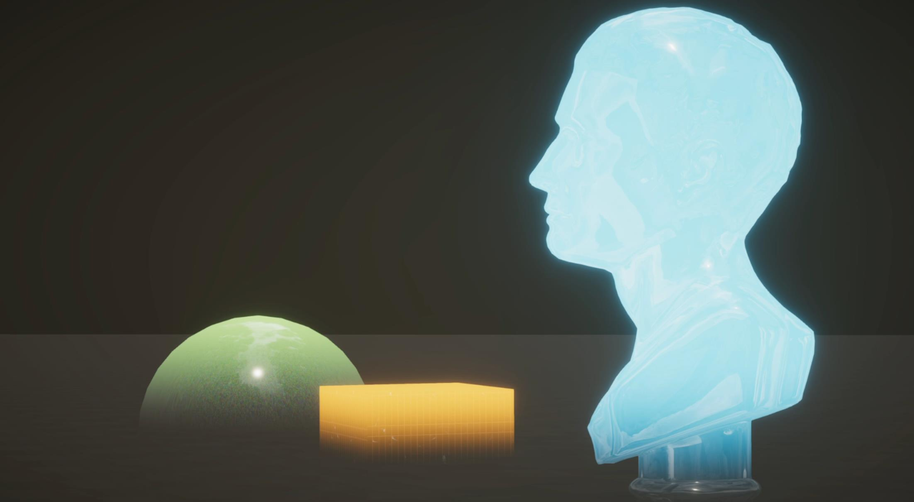

#### 2 Custom Light Flare Shape
- Reference - Genshin Impact 渊下宫 / Zone Zero / Kejiro's PPS Light Streak

#### 3 Dissolve Shader

- Distance / Position / UV based Dissolve Factor calculation
- Dissolve Edge and Color
- Noise Dissolve Edge fluctuation
- Runtime implementation
  - Material Property Block - Object Position Property Binder
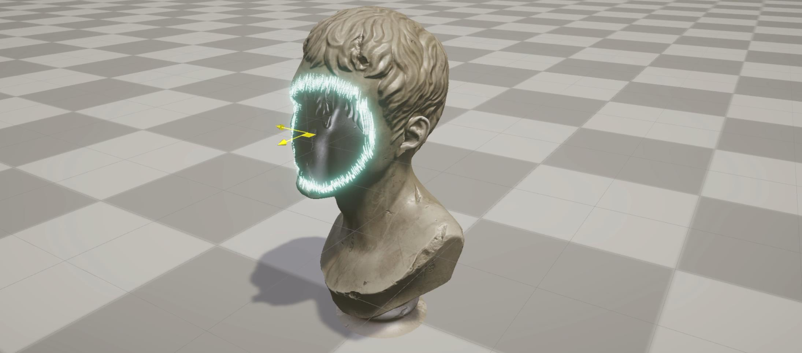
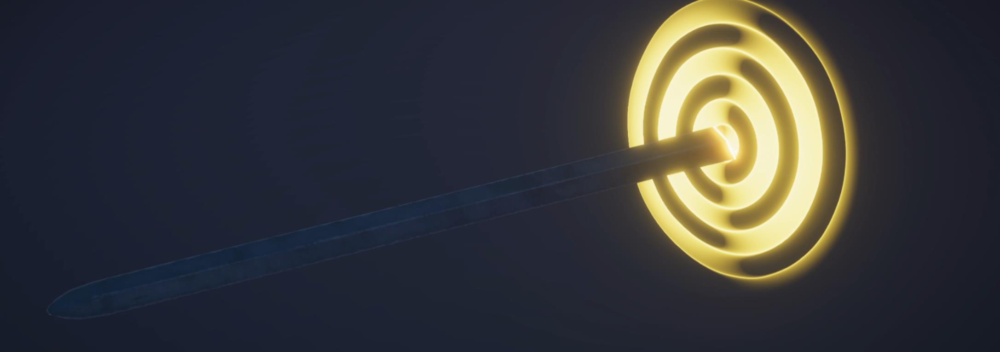
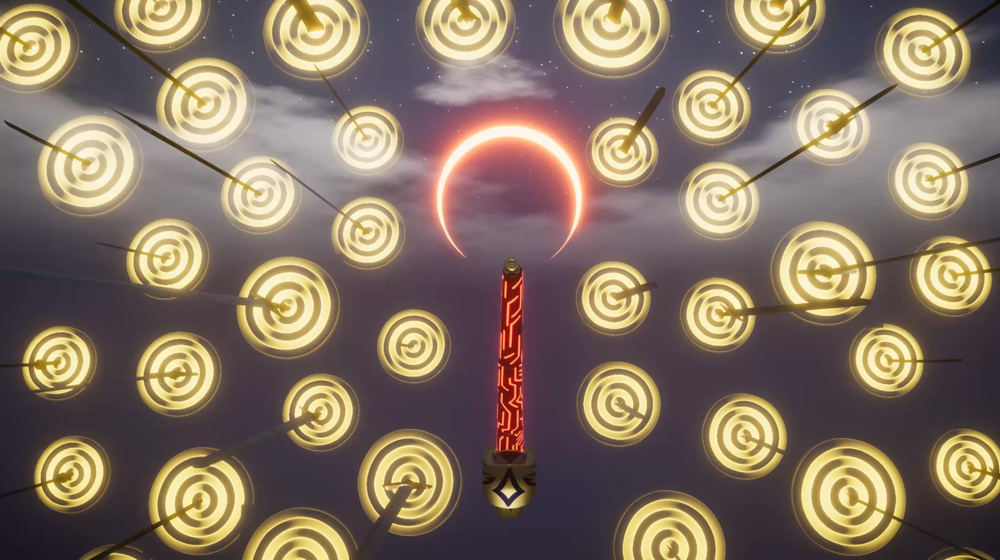

#### 4 Foil Card Shader

- TBC - Magic: The Gathering / Legends of Runeterra look

#### 5 Hologram, Holofield, Force Field Shader

- Noise based vertex displacement (high frequency and low frequency)
- World / Object / Screen Position based scan line (thin and thick)
- Fresnel Inner Outline
- Depth based edge detection and noise based variation
- Animation Process Mask map usage
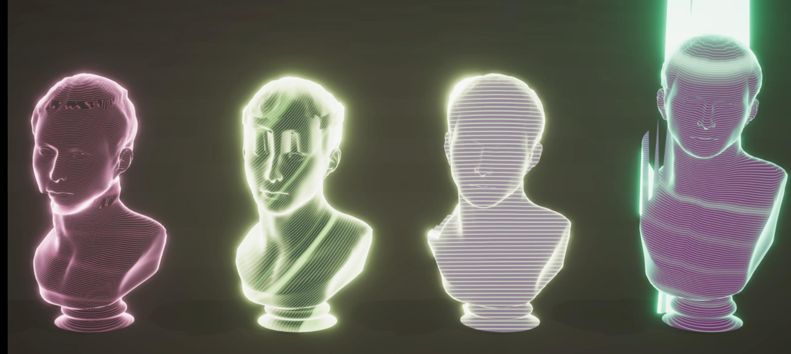
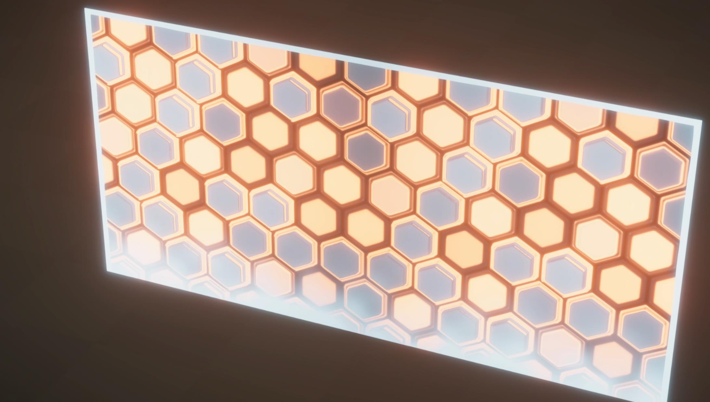

#### 6 Outline Shader

- 

#### 7 Pickable / Interactable Object

#### 8 Space Orb Shader - Inspired by TFT

- Screen Space UV Quad Formation and 2D Noise Texture distortion
- 3D Noise based shinning glitter
- Fresnel + Noise achieving flowing inner outline

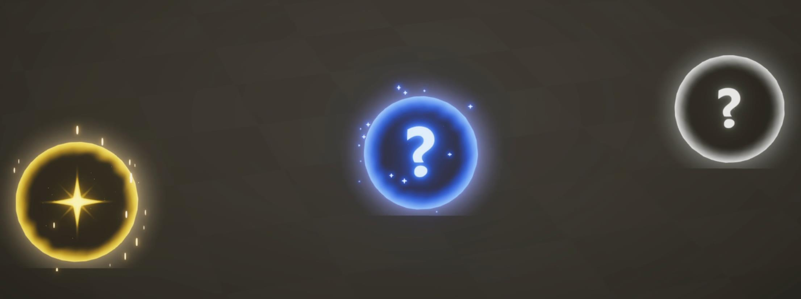

#### 9 Sparkle Glitter Shader

- TBC - Journey / Witness desert look

#### 10 Trace-On VFX - From Fate / Stay Night

- TBC

#### 11 Trail VFX

- TBC

#### 12 Vertex Displacement
- Noise-based displacement variation
- Distance based / Position based / Anime Goosebump Mockup

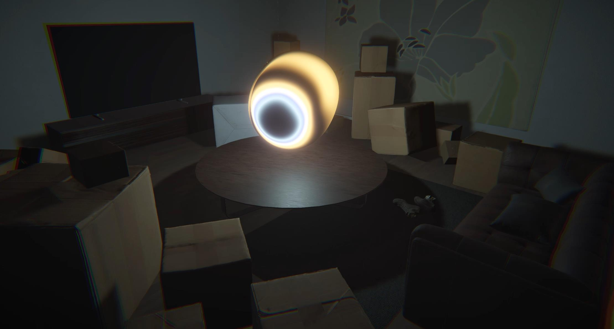
Ref:
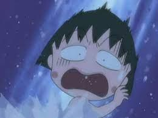

## Particle VFX Related

## Screen Space Based Shaders

### Post Processing Shaders

#### 1 Post-Process Fog

#### 2 Post Process Volumetric Lighting

- Post Processing Light Shaft
  - Occlusion Texture generation (only skybox kept)
  - Radial image blur achieving light shaft leaking effect
    - Noise offset turning pattern into noise

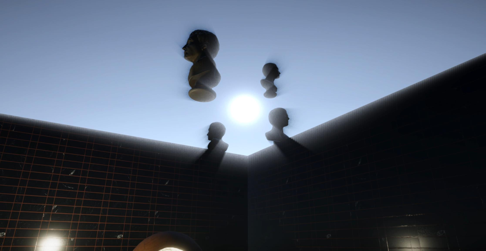

#### 3 Post Process Damaged FX

#### 4 Post Process Acceleration Effect

- Animated Speed Lines

#### 5 VHS-Image Effect & Glitch

### Other Screen Space Approaches

#### 1 Depth Buffer Related

- SSAO
- World Position Rebuild

#### 2 Stencil Buffer Related

- Portal

#### 3 TAA & FXAA

## Shading Models

#### 1 Cel Shading

- Genshin Impact Style Cel Shading, Lightmap guided, Color ramp controlled (lacks face ramp control and hair specular map usage, didn't use screen space rim light).
  - Outline pass

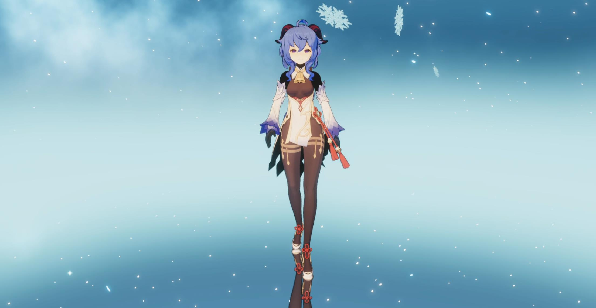
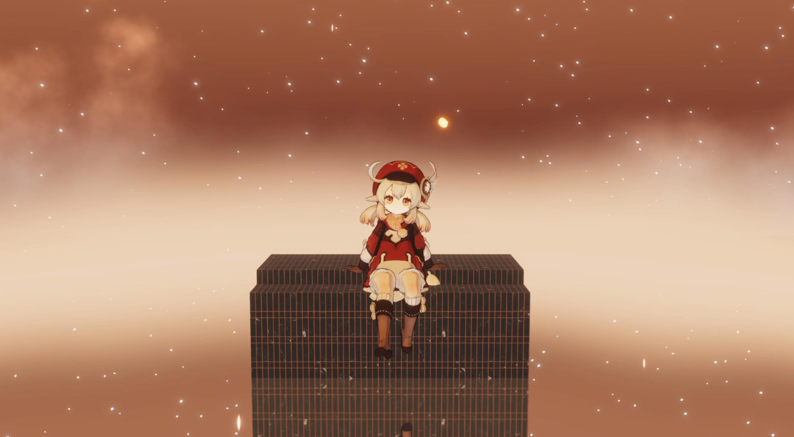

- PBR Based Cel Shading
  - Diffuse, Specular falloff and ramp control

#### 2 Flat Shading

#### 3 Gooch Shading

#### 4 NPRs

- Matcap shading

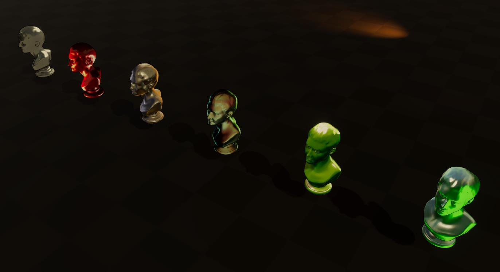

- NRP Shading
  - Multiple ramp area control
  - Diffuse, Specular, Shadow area control (for various artistic styles)
  - Specular intensity control (the smoothstep function breaks the energy conservation, thus need to tweak the value to achieve proper appearance)
  - Halftone step (UV Space / Screen Space)

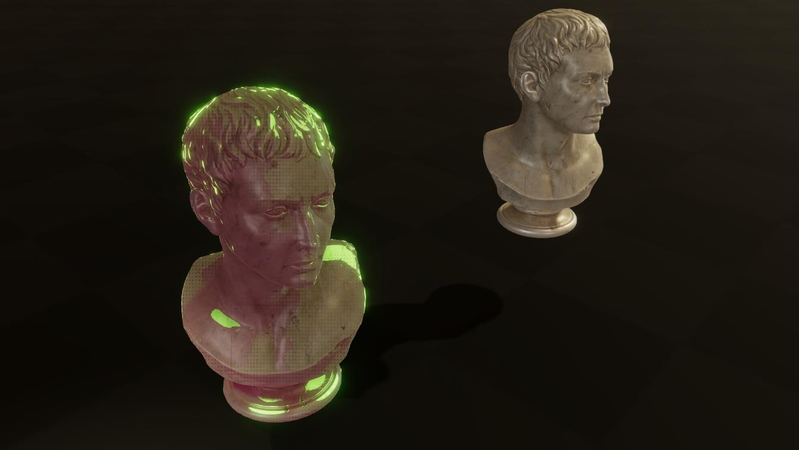
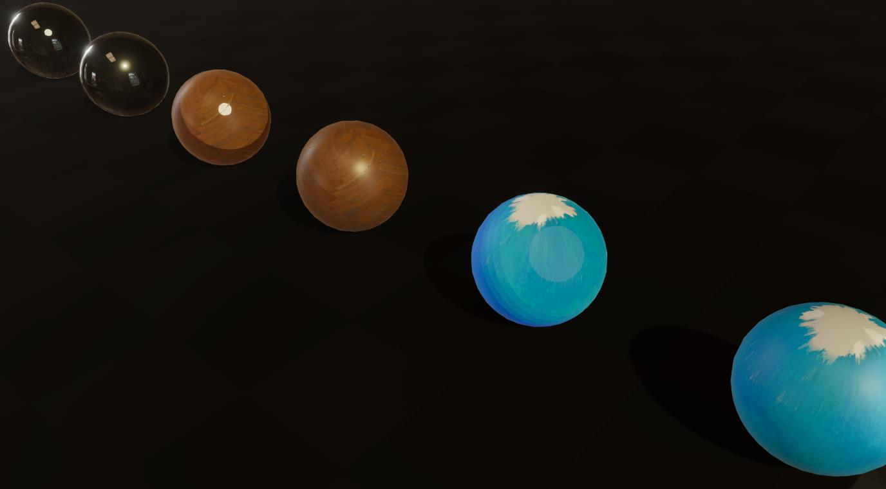
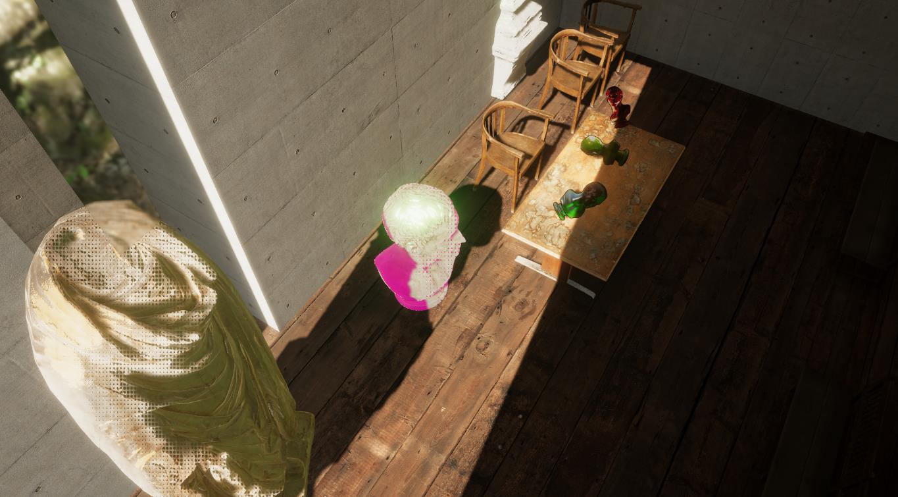
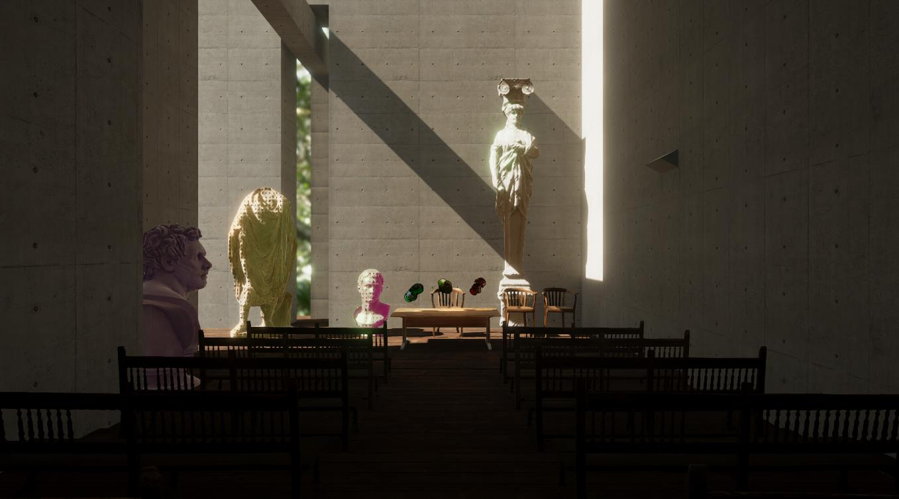

#### 5 PBR Shading

- Todo: Anisotropic Specular Calculation
- Todo: UE approach of spherical-shape light / line-shape light (representative point)
- Todo: RBF area light approach
- Todo: HDRP shader understanding

#### 6 SSS
- Todo: Fake SSS with thickness map
- Todo: Human Skin SSS rendering
- 

## Sky Related

### 1 Skybox Shader

- Reference
  - https://medium.com/@jannik_boysen/procedural-skybox-shader-137f6b0cb77c
  - https://www.patreon.com/posts/making-stylized-27402644
  - https://halisavakis.com/my-take-on-shaders-sky-shader/
- Sun and Moon SDF based Rendering
- Texture / 3D Noise based Star rendering
- Texture Cloud Rendering
  - Todo: multiple sampling achieving cloud thickness feeling
- Sky dome color ramp control
  - Todo: add atmospheric scattering colorization 

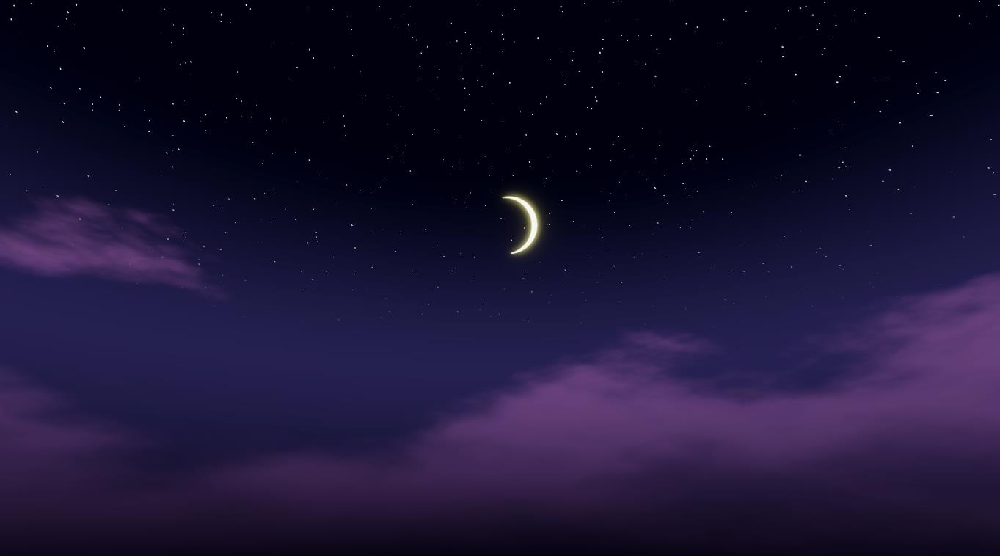

### 2  Fake Volumetric Cloud Shader

- Fake volumetric layer cloud - See: https://github.com/Zoroiscrying/UnityInteractableWater-Grass-Wind_URP
- Todo: Ray-marched volumetric cloud

## Environment Shading Techs

## Shader Systems

### 1 Global Wind 3D (Inspired by God of War Implementation)

**References**

- [Wind Simulation in God of War - YouTube](https://www.youtube.com/watch?v=dDgyBKkSf7A&t=1460s)
- [graphics.cs.cmu.edu/nsp/course/15-464/Fall09/papers/StamFluidforGames.pdf](http://graphics.cs.cmu.edu/nsp/course/15-464/Fall09/papers/StamFluidforGames.pdf)
- [Interactive Wind and Vegetation in 'God of War' - YouTube](https://www.youtube.com/watch?v=MKX45_riWQA)
- [Between Tech and Art: The Vegetation of Horizon Zero Dawn - YouTube](https://www.youtube.com/watch?v=wavnKZNSYqU)

**Showcase Pictures**

(Work in progress on artistic showcases and dynamic vegetations...)

Global Wind 3D Scene Debug

- Based on `DrawMeshInstancedIndirect`

Global Wind 2D Texture Slice Debug

- Based on Unity Post Processing and Custom PPS Render Pass

Wind Contributor Objects

- Shapes - Box, Cylinder, Sphere
- Velocity Calculation Type - Fixed, Point-based, Axis-Distance-Based

Wind Receivers (On Progress)

- Planning
  - Vegetation - Grass, Vines, Shrubs
  - Plant - Tree
  - Cloth - Non-physically-correct
  - Fur / Hair

### 2 Volumetric Lighting & Atmospheric Scattering

**References**

- https://www.slideshare.net/BenjaminGlatzel/volumetric-lighting-for-many-lights-in-lords-of-the-fallen
- [Physically Based and Unified Volumetric Rendering in Frostbite](https://www.slideshare.net/DICEStudio/physically-based-and-unified-volumetric-rendering-in-frostbite)
- [GitHub - ArthurBrussee/Vapor at master](https://github.com/ArthurBrussee/Vapor/tree/master)
- [Volumetric lights - Alexandre Pestana](http://www.alexandre-pestana.com/volumetric-lights/)
- [https://bartwronski.files.wordpress.com/2014/08/bwronski_volumetric_fog_siggraph2014.pdf](https://bartwronski.files.wordpress.com/2014/08/bwronski_volumetric_fog_siggraph2014.pdf)

**Showcase Pictures**

World-Space Ray-Marching Volumetric Lighting
- World Space Camera Ray-march, Single Scattering Calculation
- Down-sample and up-sample reducing GPU cost
- Noise offset turning pattern into noise
- Bilateral Blur keeping sharp edge
- Gaussian Blur reducing light shaft edge artifact

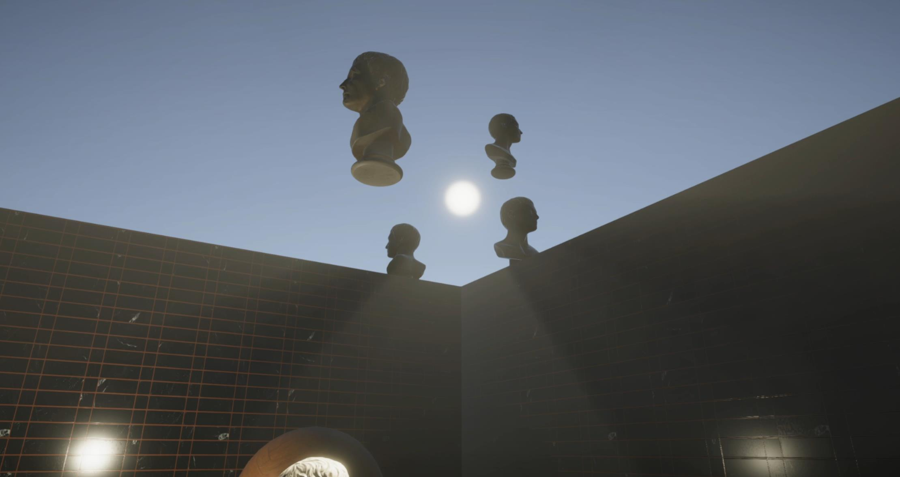

Post-Processing Radial-Blur Volumetric Lighting

- TODO: Last of Us 2 volumetric lighting
  - Frustum Voxel 3D scattering & decay texture / integration texture
  - Various light shape's precalculated integration result
  - Shadow map implementation for various light shapes
  - Down-sampling and TAA support for volumetric lighting result
- Useful code reference
  - Unity Adam showcase volumetric lighting
  - Unity HDRP Volumetric lighting implementation

### 3 Deformable Snow Ground

- Todo: Tomb Raider: Rise solution

### 4 Dynamic Weather System

- Todo: Do some research ^^.

### 5 Screen Space Particles

- Last of Us 2 screen particles approach.

**References**

- https://dl.acm.org/doi/fullHtml/10.1145/3388767.3407349

### 6 Terrain Rendering System

### 7 Displaced Vegetation, Mesh, Hair, Fur, Card

**References**

- https://www.youtube.com/watch?v=MKX45_riWQA GDC talk by Sean Feeley

### 8 Volumetric Cloud System

- Todo: Horizon: Zero Dawn volumetric cloud solution

### 9 Water & Ocean Simulation & Rendering

- Stylized Water / Ocean Shader
  - Todo: Jacobian water foam calculation
  - Todo: RT + Particle system water foam and interaction (stylized)
  - Todo: Underwater Post Process / Midwater look through effect (Maybe use stencil + post processing / world space near-camera water surface calculation + post processing)
  - Depth and ramp based water colorization
  - Gerstner / Sine wave and normal re-calculation
  - Edge foam
  - Water reflection and refraction

- Todo: FFT-based Realistic Ocean Shaders (Praise Horizon: Forbidden West and Assassin's Creed: Odyssey)
- Todo: Various Ocean simulations (Heightfield water simulation especially)

## Custom RT Approaches

### 1 Snow / Grass Foot Trail

### 2 Fluid Simulation

## Rendering Technologies and Uses

### 1 Tessellation

- Used in:
  - Stylized Water / Ocean Shader

### 2 Texture Blending

**References**

- 

### 3 Parallax Mapping

**References**

- Catlike coding: https://catlikecoding.com/unity/tutorials/rendering/part-20/

## Shader Techniques

### 1 Color Ramp

### 2 Noise Based Texture Color Variation

**References**

- 

### 3 Normal from Height Map

**References**

- 

